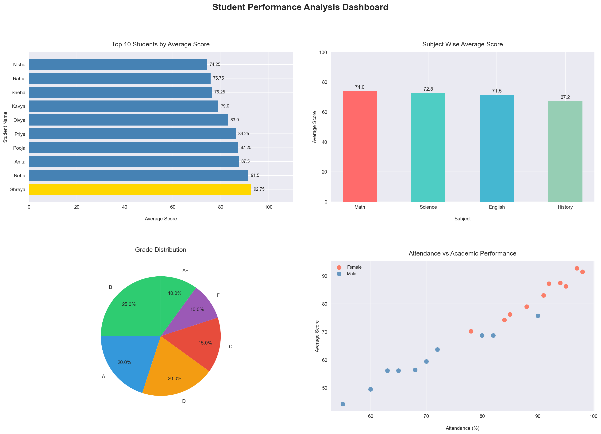

# 📚 Student Performance Analysis

## 📌 Project Overview
Analyzed student exam scores across 4 subjects to identify
factors affecting academic performance using Python.

## 🛠️ Tools Used
| Tool | Purpose |
|------|---------|
| Python | Main language |
| Pandas | Data analysis |
| Matplotlib | Charts |
| Seaborn | Styling |

## 📊 What This Project Does
- Analyzes marks of 20 students across 4 subjects
- Assigns grades (A+, A, B, C, D, F) automatically
- Finds top performers and weak students
- Studies effect of attendance on performance

## 📈 Key Insights
- ✅ Top Student: Shreya (Average: 92.75)
- ✅ Class Average: 73.5
- ✅ Best Subject: Science
- ✅ Higher attendance = Better performance

## 🖼️ Dashboard Preview


## ▶️ How to Run
```bash
pip install pandas matplotlib seaborn
python student_analysis.py
```
